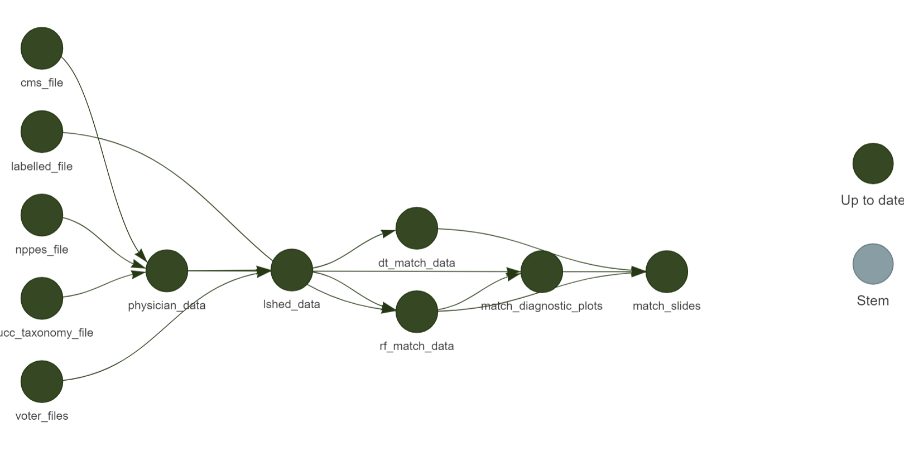

# Physican To Voter Linkage Repository:

Welcome to our repository for the physician-to-voter linkage and subsequent
analyses.

## Layout:

This repository is organized as follows:

```
.
├── code
│   ├── 00_unzip_l2.R
│   ├── 01_extract_l2.R
│   ├── 03_clean_physician_data.R
│   ├── 04_locality_sensitive_hash.R
│   ├── 05_match_model.R
│   └── match_diagnostics.R
├── figures
│   ├── age_dist_hist.png
│   ├── at_a_glance.png
│   ├── matches_by_state.png
│   ├── processing.png
│   └── screenshot.png
├── linkage_slides.Rmd
├── pres.bib
├── README.md
└── _targets.R
```

* The `code/` directory houses the functions used to complete the linkage and
subsequent diagnostics.

* The `_targets.R` file contains the master script to run the entire analysis
pipeline using the [targets](https://books.ropensci.org/targets/) R package,
which rebuilds downstream pieces of code if and only if uspstream code has
changed. This saves time and means we can ensure reproducibility without
re-running the pipeline after each change. The pipeline can be run by calling
`targets::tar_make()` in R.

* The `figures/` directory holds the outputs produced by the pipeline. A seperate
`tables/` folder will likely be created further along in the project.

* `linkage_slides.Rmd` and `pres.bib` are both used to generate the slides shared
with the team.

## Dependency Graph:

Here is a path of the code dependencies in the repository. It is not
live-updating, and so will not respond to changes in the architecture /
pipeline, but it is useful to see a roughly-current summary of the analysis
code now.



## Other Useful Links:

Package site for [zoomerjoin](https://github.com/beniaminogreen/zoomerjoin),
our in-house package to perform fast fuzzy-linking on name.
