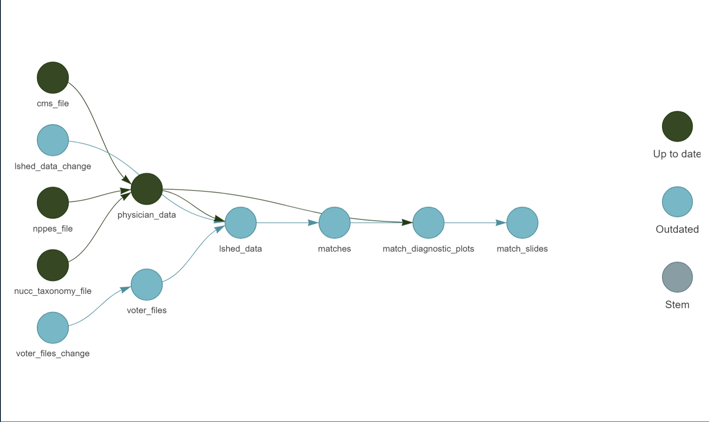
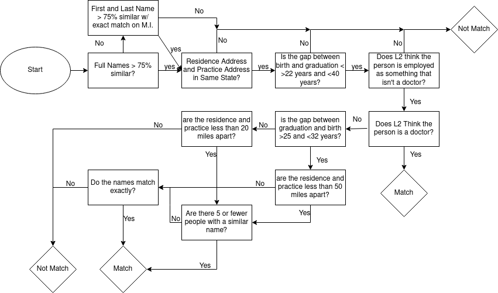

```{r, include=F}
library(arrow)
library(stargazer)
library(tidyverse)
library(targets)
library(zoomerjoin)
upsize_theme <-
    theme_bw() +
    theme(axis.text=element_text(size=14),
        axis.title=element_text(size=16,face="bold"))
```


# Summary

* Fast, performant and interpretable way to link L2 voter data to NPPES Physician data

* Combines a fast similarity search that identifies similar voters / physicians with a bespoke set of rules to determine which voters match to which units.


# High Level-Summary:



# Secret Sauce: Locality Sensitive Hashing

* Computational technique that allows us to know which pairs of strings are
  similar without making all pairwise comparisons [@Broder @massive]

* Works by hashing each name several times, in a way that similar strings are
  given the same hash key,

Example:

| Bucket 1        | Bucket 2        | Bucket 3      |
| ---             |    ----         | ------        |
| Ben Green       | Jacob Wallace   | Chima Nudemle |
| Ben Greene      | Jacob Wallance  |               |
| Beniamino Green |                 |               |

* Only units in same bucket are considered as possible matches

# What's Going On? Comparisons Made With AllPairs:

```{r, echo = F}

df = expand_grid(
            x = 1:200,
            y = 1:200
            ) %>%
mutate(
       match =  x == y,
)

df  %>%
    ggplot(aes(x=x,y=y)) +
    geom_raster(fill = "blue")  +
    theme_minimal() +
    theme(legend.position = "none") +
    xlab("ID in X") +
    ylab("ID in Y") +
    annotate("label", x=140, y=160, label="40K\nComparisons Needed") +
    xlim(0,201) +
    scale_y_reverse(limits = c(201,0)) +
    upsize_theme
```

# What's Going On? Comparisons Made With LSH:

```{r, echo=F}
df4 <- df %>%
    mutate(
        match = ifelse(runif(nrow(df))<.02, T, match)
    )

df4  %>%
    ggplot(aes(x=x,y=y, fill = match)) +
    geom_raster()  +
    theme_minimal() +
    xlab("ID in X") +
    ylab("ID in Y") +
    annotate("label", x=140, y=160, label="1035 Comparisons Needed") +
    xlim(0,201) +
    scale_y_reverse(limits = c(201,0)) +
    scale_fill_manual(values = c("darkgrey", "blue")) +
    upsize_theme +
    theme(legend.position = "none")

```


# Post-LSH Processing



# Processed Data - Distribution of Age Gap:

```{r, echo=F, fig.align="center"}
knitr::include_graphics(tar_read(match_diagnostic_plots)[1])
```

* Correspond Closely to age at graduation statistics from @Staiger_2022, and shifted age at matriculation statistics from @aamc.

# Match Breakdown by State:

```{r, echo=F, fig.align="center"}
knitr::include_graphics(tar_read(match_diagnostic_plots)[2])
```

# Extra Stats:

* $>$ 99.99% of matched voters have residential address recorded
* 88 % of matched voters predicted / reported ethnicity
* 100% coverage for partisan affiliation.
* 39% Democratic, 37% Republican, 23% Non-Partisan

# How Many Matches Should We Expect?:

* 1 million physicians in the NPPES file
* ~ 10% should be non-citizens, and not eligible to vote
* ~ 1/3 will be not registered to vote (assuming doctors are as likely to register as general populaiton)
* We expect there are 600K physicians registered to vote
* We match `r sum(tar_read(augment_lsh_data)$match_prob, na.rm=T)`

# Potential Extensions: Bayesian Linkage Model

* LSH-preprocessing step makes it feasible to run a Bayesian model (Felligi-Sunter / Naive Bayes) on a dataset of this size
* Could also hand-label a set of matches and use a Random Forest or other comparable method to extend to the entire dataset. 

# Match Statistics: Random Forest Method:

```{r, echo=F, results = "asis"}
data <- tar_read(rf_match_data)
data %>% select(
  full_name_sim, 
  mid_initial_agree, 
  zip_dist, 
  year_dist, 
  medical, 
  n,
) %>%
  as.data.frame() %>%
  stargazer(
    header=F,
    summary.stat = c("min", "p25", "median", "p75", "max", "N"),
    digits =2,
    font.size="tiny"
            )
```

# Match Statistics: Tree-Based Method:

```{r, echo=F, results = "asis"}
data <- tar_read(dt_match_data)
data %>% dplyr::select(
  full_name_sim, 
  mid_initial_agree, 
  zip_dist, 
  year_dist, 
  medical, 
  n,
  Voters_Gender,
) %>%
  as.data.frame() %>%
  stargazer(
    header=F,
    summary.stat = c("min", "p25", "median", "p75", "max", "N"),
    digits =2,
    font.size="tiny"
  )
```

# Next Steps:

* When to move to the next steps of analysis?
* Any validation checks that we can run?
* Other methods for pruning matches post LSH?

# References:


